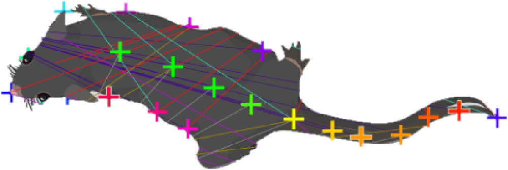

  
  
## 3.1 Read the DLC Documentation  
Before you start, make sure you are familiar with the general idea of DLC and that you have read through (at least) parts of the official documentation.  
See [2. About DeepLabCut > 2.2 Important Links](2.%20About%20DeepLabCut.md#2.2%20Important%20Links) for an overview of different links to get you started.  
  
## 3.2 Choose Appropriate Keypoints  
  
Let’s assume you are working with rodents. The above picture is taken from the DLC website and is a labelling guide for the SuperAnimal-TopViewMouse model.  
We will work with the keypoints associated with the model in order to be able to donate the data. See [2. About DeepLabCut > 2.3 Donating Data](2.%20About%20DeepLabCut.md#2.3%20Donating%20Data).  
  
The base keypoints are:  
  
```yaml  
- nose  
  
- left_ear  
  
- right_ear  
  
- left_ear_tip  
  
- right_ear_tip  
  
- left_eye  
  
- right_eye  
  
- neck  
  
- mid_back  
  
- mouse_center  
  
- mid_backend  
  
- mid_backend2  
  
- mid_backend3  
  
- tail_base  
  
- tail1  
  
- tail2  
  
- tail3  
  
- tail4  
  
- tail5  
  
- left_shoulder  
  
- left_midside  
  
- left_hip  
  
- right_shoulder  
  
- right_midside  
  
- right_hip  
  
- tail_end  
  
- head_midpoint  
```  
  
Most of the labels should be self-explaining. Here are some clarifications from Mackenzie Mathis, PhD (lead author of DLC):  
  
>  the only point not on the diagram is head_midpoint (which is just the middle of the head). Ears we tend to mark in the middle of the base of the ear.  
  
An additional issue are the 7 keypoints for the tail `tail_base`, `tail1` to `tail5`, and `tail_end`. Due to the high flexibility of the tail, it is difficult to reliably place the 5 points between the base and of the tail at equal distances. There is no way around this issue and you just need to estimate where each point should be, despite awkward angles or positions.  
  
> [!warning] Important  
>  Do not place keypoints that you cannot actually see! DLC is fine with incomplete labelled frames!  
  
Here are some additional keypoints we decided on to improve the analysis and allow further analysis with [5. Moving Beyond DLC > X.2 ETH-DLCAnalyzer](5.%20Moving%20Beyond%20DLC.md#X.2%20ETH-DLCAnalyzer).  
  
```yaml  
- chin #for rearing animals to properly track head movement  
  
- throat #same as above  
  
- tl_corner #top left corner to draw cage layout in R   
  
- tr_corner #top right   
  
- bl_corner #bottom left  
  
- br_corner #bottom right   
  
- odor_source #in case animals move it around  
```  
  
## 3.3 Data Pre-processing  
  
Pre-processing can be done in [SIMBA](https://github.com/sgoldenlab/simba) (see also [5. Moving Beyond DLC > X.3 SIMBA](5.%20Moving%20Beyond%20DLC.md#X.3%20SIMBA)) or [Shutter Encoder](https://www.shutterencoder.com/en/) or any other software.  
  
### 3.3.1 Must-Do  
  
If your video has several experimental conditions (e.g. baseline and exposure), it should be cut into separate videos in order to allow a proper post-DLC analysis. ==DOUBLE CHECK IF THIS IS ACTUALLY TRUE!!!!!!!!!== `[!!flag:Review]`  
Remember to also trim the start and end of the videos in order to reduce analysis time.  
  
### 3.3.2 Nice to Have  
  
In order to reduce processing time of the videos, you can crop the video to only show the experimental set-up.  
Probably only worth it, if there is a lot of extra space visible in the frame.  
  
Ipsum  
