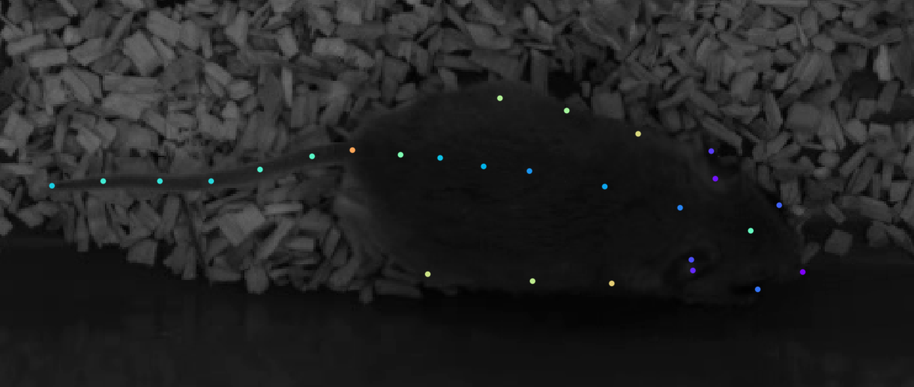

  
  
## 4.1 Starting a New Analysis  
Start `conda` environment and start DLC GUI.  
  
> [!note]  
> Use an Anaconda powershell (or any command line tool) as administrator!  
  
  
```shell  
conda activate DEEPLABCUT #Or however the environment is called  
  
python -m deeplabcut  
```  
  
  
  
Click “New project”  
  
  
  
Fill all information.  
  
> [!note]  
Number of cameras refers to the amount of cameras filming the same animal, e.g. top and side view.  
Make sure to check “Copy videos to project folder”. We encountered one instance of test videos getting corrupted during the analysis  
  
> [!warning]  
Do NOT include special characters (e.g. ô é ä etc) in the project name or the experimenter name! This WILL cause issues during the analysis. See [XY. Common Errors and Fixes > XX.2.1 Literally Any DLC Error Message](./XY.%20Common%20Errors%20and%20Fixes.md#XX.2.1%20Literally%20Any%20DLC%20Error%20Message)  
  
## 4.2 Labelling Frames  
  
  
  
  
  
## 4.3 Training the Model & Labelling Frames  
  
## 4.4 Fix Outliers, Merge New Training Data, & Create New Training Iteration  
  
Lorem  
