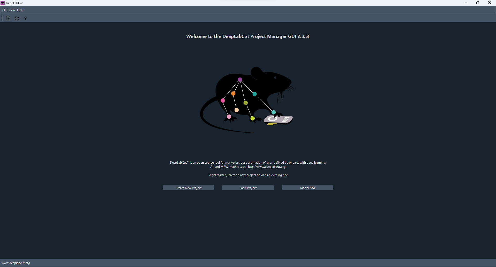
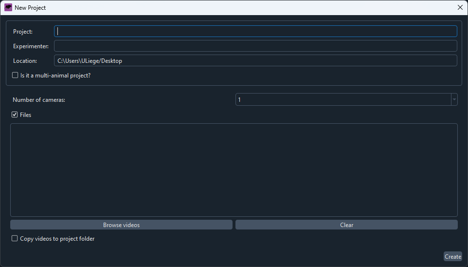
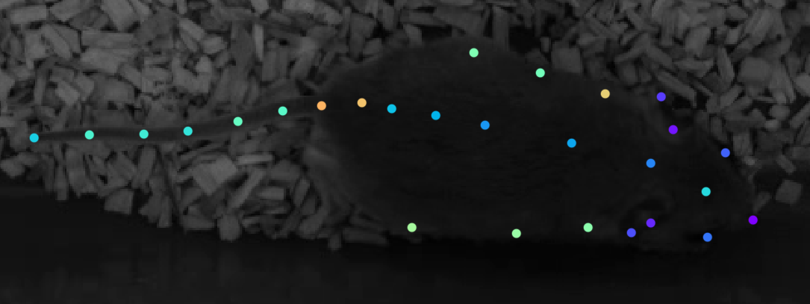
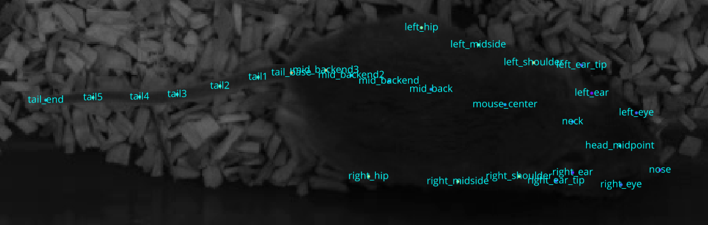
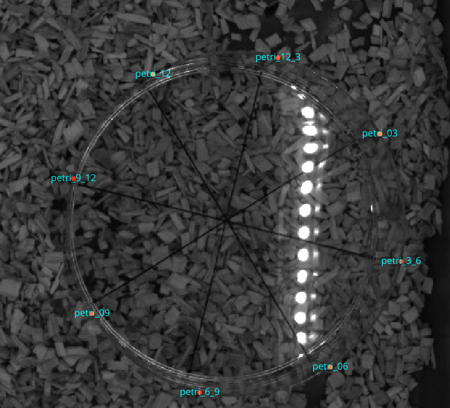

  
  
## 4.1 Outline of the Workflow  
  
The general DLC workflow looks as follows:  
  
1. Initiate project  
2. Add videos to `config.yml`  
3. Extract frames  
4. Manually label frames  
5. Train the model  
6. Analyze videos  
7. (Optional) Extract outlier frames  
8. (Optional) Manually label outlier frames  
9. (Optional) Merge datasets  
10. (Optional) Retrain the model  
11. (Optional) Analyze videos  
12. Create labelled videos  
  
## 4.2 Starting a New Analysis  
  
Start `conda` environment and start DLC GUI.  
  
If you are running DLC on a cluster, proceed to [4. DLC Analysis > 4.5 Running DLC on a cluster (LUCIA)](4.%20DLC%20Analysis.md#45-running-dlc-on-a-cluster-lucia).  
  
> [!note]    
> Use an Anaconda powershell (or any command line tool) as administrator!  
  
  
```shell  
conda activate DEEPLABCUT #Or however the environment is called  
  
python -m deeplabcut  
```  
  
  
  
Click “New project”  
  
  
  
Fill all information.  
  
> [!note]    
Number of cameras refers to the amount of cameras filming the same animal, e.g. top and side view.    
Make sure to check “Copy videos to project folder”. We encountered one instance of test videos getting corrupted during the analysis  
  
> [!warning]    
Do NOT include special characters (e.g. ô é ä etc) in the project name or the experimenter name! This WILL cause issues during the analysis. See [XY. Common Errors and Fixes > XY.2.1 Literally Any DLC Error Message](./XY.%20Common%20Errors%20and%20Fixes.md#xy21-literally-any-dlc-error-message)  
  
## 4.3 Labelling Frames  
  
    
    
  
  
## 4.4 Training the Model & Analyze Videos  
  
## 4.5 Fix Outliers, Merge New Training Data, & Create New Training Iteration  
  
## 4.6 Running DLC on a Cluster (LUCIA)  
  
> [!note]    
This section is specifically tailored for running DLC on the LUCIA cluster accessed via the University of Liège, but the same principles should apply to other clusters.  
  
> [!warning]    
> You will need to be somewhat familiar and comfortable to navigate via the command line.    
> Not all surrounding concepts are explained in detail, since this is not a guide on using the cluster, but how to run DLC.  
  
You first need to get access to LUCIA. Check [here](https://support.ceci-hpc.be/doc/_contents/QuickStart/ConnectingToTheClusters/index.html) and [here](https://doc.lucia.cenaero.be/connect/ssh/) for more details on how to access the cluster and prerequisites.    
Also, carefully read the welcome email from LUCIA!  
  
### 4.6.1 Initial Set-up on LUCIA  
  
Install `DeepLabCut` in your directory.  
  
```bash  
module load devel/python/Anaconda3-2022.05  
conda create --name DEEPLABCUT   
conda activate DEEPLABCUT    
pip install deeplabcut    
conda install ffmpeg  
```  
  
> [!note]    
> If you need a pre-release version directly from GitHub for some critical bug fixes, you should create a separate environment and run the following:  
  
 ```bash  
module load devel/python/Anaconda3-2022.05  
conda create --name DLC_dev  
conda activate DLC_dev    
pip install --force-reinstall git+https://github.com/DeepLabCut/DeepLabCut@main    
conda install ffmpeg  
 ```  
  
### 4.6.2 Transferring Data between LUCIA and `mass storage`  
  
#### `mass storage` → LUCIA  
  
Connect via ssh to the `mass storage`. See [here](https://giga-bioinfo.gitlabpages.uliege.be/docs/mass-storage-and-cluster/getting_started/connect/ssh.html) how to do that. This step can be done from within MobaXterm.  
  
> [!warning]    
> If you are using `rsync` for the first time, add the `--dry-run` parameter to see what will actually happen.    
> Once you are happy with the output, you can remove it and do the actual sync.  
  
```bash  
# optional for large files  
screen # or tmux  
  
# sync  
rsync -av --progress --no-p --no-g --chmod=ug=rwX path/to/source/folder USERNAME@frontal.lucia.cenaero.be:path/to/destination  
```  
  
#### LUCIA → `mass storage`  
  
Connect to the `mass storage`.  
  
```bash  
# optional for large files  
screen  
  
# sync  
rsync -av --progress --no-p --no-g --chmod=ug=rwX USERNAME@frontal.lucia.cenaero.be:/gpfs/projects/acad/behavior/videos/ /stornext/snfs1/SHARE/URT/<Unit>/<Lab>/<Team>/<Project>/<Folder>  
```  
  
```bash  
rsync -av --progress --no-p --no-g --chmod=ug=rwX /gpfs/projects/acad/behavior/videos/2023-11-13_conspecific_odor_videos/ tsievert@nic5.uliege.be:/scratch/users/t/s/tsievert/2023-11-13_conspecific_odor_videos/  
  
  
rsync -av --progress --no-p --no-g --chmod=ug=rwX scratch/users/t/s/tsievert/2023-11-13_conspecific_odor_videos/ u240769@massstorage.giga.priv:/massstorage/URT/NEU/EVONEURO/SOCIAL-BEHAVIOR/2023-11-13_conspecific_odor_videos/  
```  
  
### 4.6.2 Starting DLC on LUCIA  
  
Confirm that everything is working on the `debug` node.  
  
```bash  
tmux new -s mysession # start tmux with name mysession to keep session active if computer goes to sleep  
srun --account=behavior -p debug-gpu --gpus=1 --time=1:00:00 --pty bash  
module load devel/python/Anaconda3-2022.05  
conda activate DEEPLABCUT  
module load CUDA/11.7.0 TensorFlow/2.11.0-foss-2022a-CUDA-11.7.0  
cd /gpfs/projects/acad/behavior/softs/DeepLabCut/examples/  
python testscript.py  
```  
  
### 4.6.3 Submitting SLURM Scripts  
  
```bash  
sbatch DLC_batch_extract.sh /gpfs/projects/acad/behavior/videos/2023-11-13_conspecific_odor_videos/cohort1/  
  
/gpfs/projects/acad/behavior/videos/2023-11-13_conspecific_odor_videos/cohort2/  
/gpfs/projects/acad/behavior/videos/2023-11-13_conspecific_odor_videos/cohort3/  
/gpfs/projects/acad/behavior/videos/2023-11-13_conspecific_odor_videos/cohort4/  
/gpfs/projects/acad/behavior/videos/2023-11-13_conspecific_odor_videos/cohort5/  
/gpfs/projects/acad/behavior/videos/2023-11-13_conspecific_odor_videos/cohort6/  
```  
  
The logic is `sbatch submission_script.sh /file_path/` for the SLURM script.    
Each SLURM script defines an output file formatted as `jobID_jobName`, so no need to specify it for each call.    
Each SLURM script also contains `python script_name.py $1`, where `$1` refers to the `/file_path/` in the `sbatch` call.    
Each DLC script contains ```  
  
```python  
my_path = sys.argv[1]  
video_file_path = glob.glob(os.path.join(my_path, "*.mp4"))  
```  
  
which will first set `my_path` to `$1` and therefore `/file_path/` from the `sbatch` submission, and as a second step create a list of all `mp4` files inside `my_path` and pass them as a list of strings to `video_file_path`.  
  
See [[XZ. Code directory]] for an overview of all scripts.  
  
> [!warning]    
> Due to a recent bug in DLC (see [issue here](https://github.com/DeepLabCut/DeepLabCut/issues/2482)) this does not work at the moment!    
> All file paths need to be explicitly stated in the script, unfortunately.    
> This warning will be removed once the issue is fixed.    
> In order to print all video files in a directory and then directly copy and paste them into your script, use  
> ```bash  
> ls -l /gpfs/projects/acad/behavior/videos/2023-11-13_conspecific_odor_videos/cohort1/ | awk '/\.mp4$/ {printf "\"/gpfs/projects/acad/behavior/videos/2023-11-13_conspecific_odor_videos/cohort1/%s\",\n", $NF}' | sed '$s/,$//'  
> ```  
> and adjust the file path as needed.  
  
``  
  
```bash  
sbatch --dependency=afterany:3349774:+3 DLC_submit_add_extract_cohort6.sh  
  
  
ls DLC_submit_analyze_coh*.sh | xargs -i sbatch {}   
```  
  
### 4.6.4 DLC Benchmarks on LUCIA  
  
To estimate how long you need to perform certain tasks, here a few benchmarks we have collected from LUCIA.  
  
#### 4.6.4.1 Extracting Frames  
  
Extracting frames with `kmeans` can take quite a while since each video is down-sampled first, frames are extracted, and then an algorithm compares the frames.    
For a 20 minutes video with 200fps, we have gotten the following results (rounded up).  
  
| cluster_step | time per video (min) |  
| ------------:| --------------------:|  
|            1 |                   40 |  
|           10 |                   13 |  
|           20 |                    7 |  
|           50 |                    3 |  
  
Extracting frames with `uniform` is much faster (and doable on a desktop computer) but was not tested on the cluster.  
  
> [!NOTE]    
> Real-life results differed from initial benchmarks.    
> With `cluster_step=10` it actually took about 17 minutes per video on LUCIA with 40GB GPU memory.    
> It remains unclear why there is such a difference.  
  
#### 4.6.4.2 Training a Model  
  
#### 4.6.4.3 Analyzing Videos  
  
Analyzing a set of 10 videos took about 15h (±5 minutes) on LUCIA with 40GB GPU memory, so about 90 minutes per video..  
