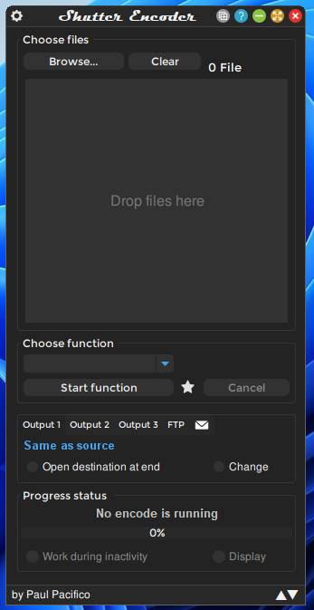
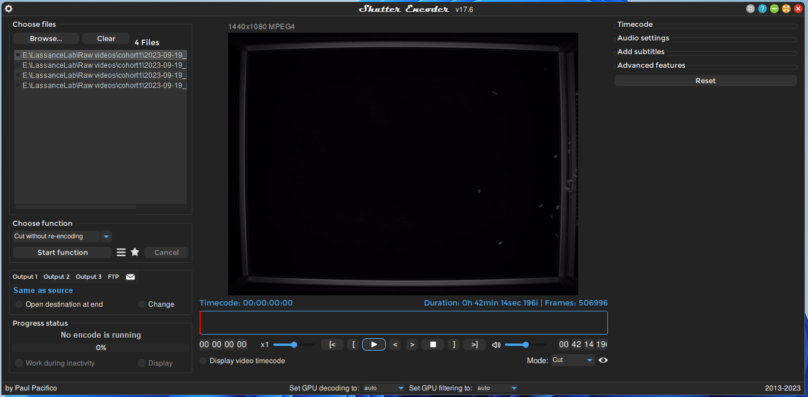
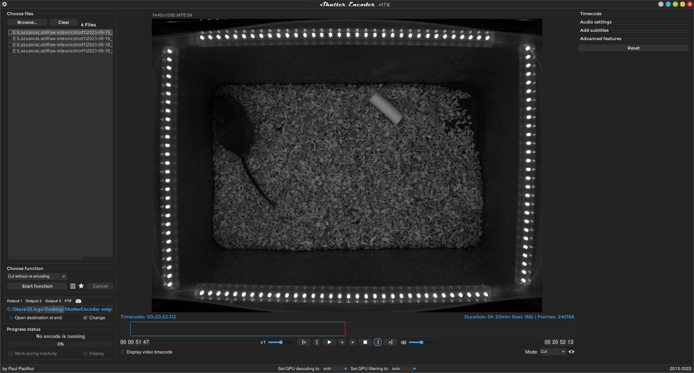
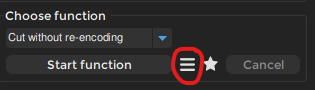
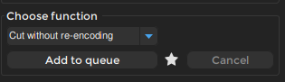
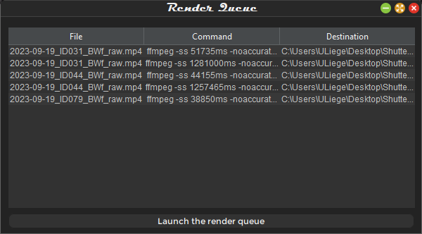

  
  
## XX.1 Shutter Encoder  
  
Download: [Shutter Encoder](https://www.shutterencoder.com/en/)  
  
    
Click `Browse` to add all the videos you want to cut.    
Under `Choose function` select `Cut without re-encoding` and the following window will open.  
  
    
Remember to select a different output folder (if desired) under `Output 1` → `Change` and set a folder.    
The blue box is the current selection.    
The red bar is the current position in the video.  
  
    
Drag the edges of the blue to the desired positions. Use the `[` and `]` buttons to set the beginning of the selection to the current position of the red bar.    
With these settings, each selection will be processed into a separate video.  
  
> [!warning]    
> Do not drag the beginng of the box past the end of the box. The entire selection box will vanish and you will need to restart Shutter Encoder.  
  
    
To add a second selection or edit another video, click the hamburger menu next to `Start function`. This will open the queue.  
  
    
Now click `Add to queue` for each selection and video.  
  
    
Once finished with all the videos, click `Launch the render queue` and all previous selections and videos will be processed.  
